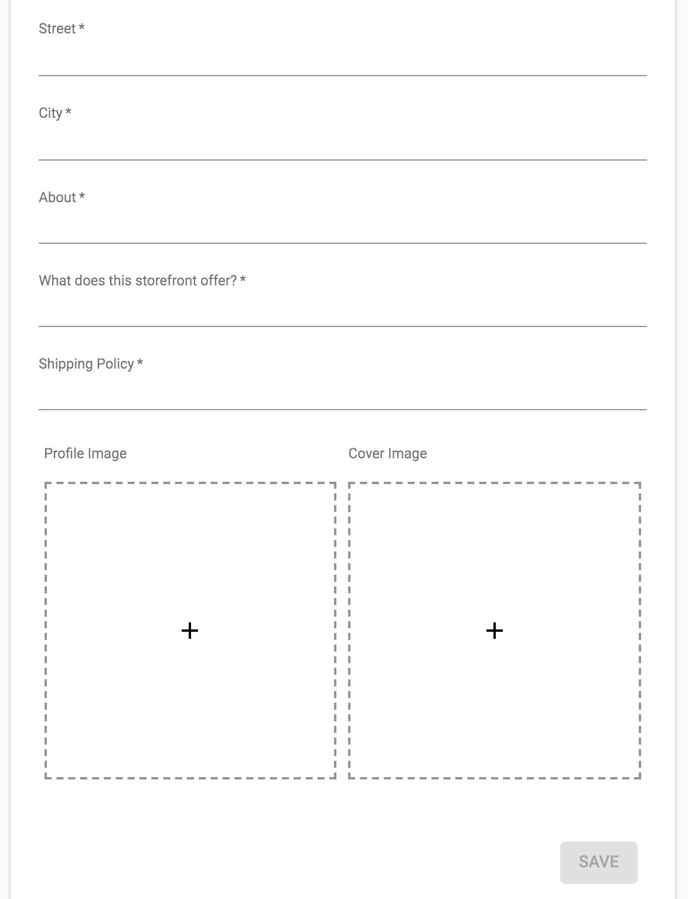

# react-material-filefield
A react component to upload and display files in a nicely formatted material-ui grid list.

## Installation:
```
npm install react-material-filefield
```

## Appearance:
Empty Fields


Filled fields


Filled fields, multiple columns


## Usage:
```
import React from 'react';
import FileField from "react-material-filefield";

class Example extends React.Component {
    constructor(props) {
        super(props);
        this.state = {
            files: null
        }
    }

    componentWillReceiveProps(nextProps) {
        if (!!nextProps.fileURL) {
            this.handleResetFiles("files", () => {
                this.handleLoadUrl("files", url);
            });
        }
    }

    handleLoadUrl = (field, url) => {
        let file = {
            name: 'somefile.ext',
            preview: url,
        }
        let files = this.state[field] || [];
        files.push(file);
        this.setState({ [field]: files });
    }

    handleAddFile = (field, file) => {
        let files = this.state[field] || [];
        files.push(file);
        this.setState({[field]: files});
    }

    handleRemoveFile = (field, index) => {
        let files = this.state[field] || [];
        if (files.length > 0) files.splice(index, 1);
        this.setState({[field]: files});
    }

    handleResetFiles = (field, callback = (() => {})) => {
        // Revoke any data URL's in existence.
        let files = this.state[field] || [];
        for (let file in files) {
            if (!file.preview) continue;
            window.URL.revokeObjectURL(file.preview);
        }
        this.setState({
            [field]: initialState[field],
        }, () => callback());
    }

    render() {
        let files = this.state.files || [];

        return (
            <FileField
                title="Files"
                cols={1}
                multiple={false}
                accept="image/*"
                minImageWidth={1920}
                minImageHeight={1080}
                maxFileSize={10485760} // 10MB
                files={files}
                onAddFile={(file) => this.handleAddFile("files", file)}
                onAddError={(message) => console.log(message)}
                onRemoveFile={(index) => this.handleRemoveFile("files", index)}
                required
            />
        );
    }
}

## Props: (optional)
* (gridListContainerStyle): PropTypes.object, styles to apply to the grid list container. Helpful to limit height and force scroll.
* (title): PropTypes.string, field title text.
* (cols): PropTypes.number, the number of grid list columns to display.
* accept: PropTypes.string, file types accepted, example "*" or "images/*".
* (multiple): PropTypes.bool, allow or disallow multiple images being added.
* (disabled): PropTypes.bool, activates or disables the form field.
* (minImageWidth): PropTypes.number, min image width in pixels.
* (minImageHeight): PropTypes.number, min image height in pixels.
* (maxFileSize): PropTypes.number, max file size in bytes.
* files: PropTypes.array.isRequired, an input of what files to display.
* onAddFile: PropTypes.func.isRequired, the callback that passes a successfully added file.
* onAddError: PropTypes.func.isRequired, the callback that passes a message when a file fails to be added.
* onRemoveFile: PropTypes.func.isRequired, the callback that passes the index of a file to remove.
* (maxNumFiles): PropTypes.number, the max number of files to add/display in the field.
```
